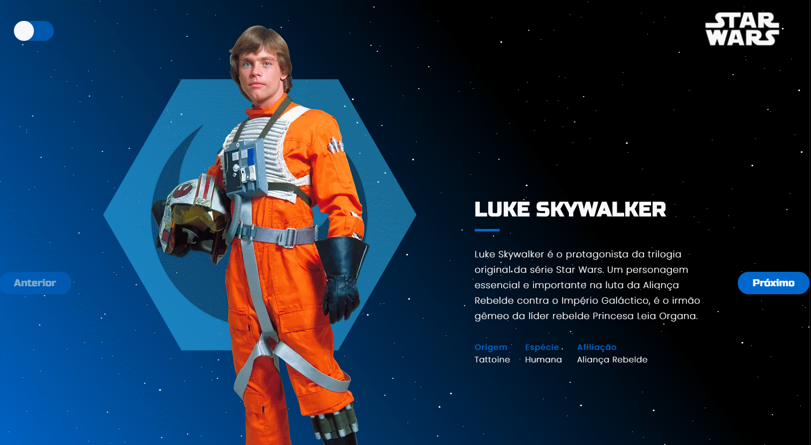

<h5 align=center>
 

🎨 Design por [Adriana Lima](https://github.com/dxwebster)

</h5>

---

## 🔖 Star Wars Characters Profile

Essa é uma aplicação que traz o nome e descrição de alguns personagens do Star Wars para praticar alguns conceitos do ReactJS, como:

- Consumo de Fake API com Json Server
- Mudaça de Temas com Theme Provider do Styled Components

## 📥 Executar esse projeto no seu computador

- Clonar Repositório: `git clone https://github.com/dxwebster/Star-Wars-Info.git`
- Ir para a pasta: `cd Star-Wars-Info`
- Instalar dependências: `yarn`
- Rodar Aplicação: `yarn start`

## 🛠 Como criar esse projeto do zero

Confira passo a passo na aba wiki:

[1. Criação de uma Fake API com Json Server](https://github.com/dxwebster/Star-Wars-Characters-Profile/wiki/Cria%C3%A7%C3%A3o-de-uma-Fake-API-com-Json-Server)

Em construção...

## 📕 Licença

Todos os arquivos incluídos aqui, incluindo este _Readme_, estão sob Licença MIT. 
Criado com ❤ por [Adriana Lima](https://github.com/dxwebster)
